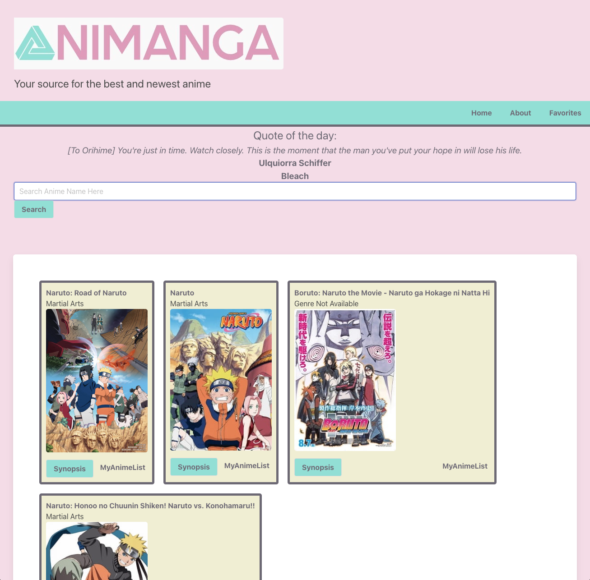
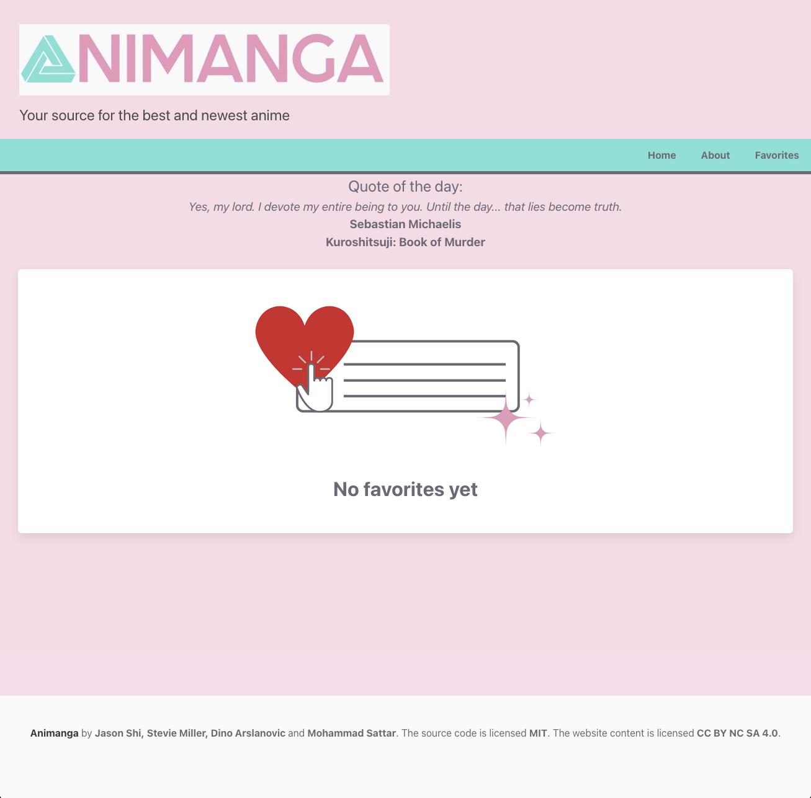

# Animanga

A database for anime 

## Description

This web application was to satisfy the requirements for the first project in coding bootcamp. 
The user can enter a title to search for all available anime under that title, including a synopsis.

## Installation

This web app runs on most browsers. You can visit the deployed link here: https://jshigoodies.github.io/Animanga/

## Screenshots

## Contributing

- [Jason Shi](https://github.com/Jshigoodies)
- [Dino Arslanovic](https://github.com/dinoarslanovic26)
- [Mohammad Sattar](https://github.com/UrEmotional)
- [Stevie Miller](https://github.com/StevieMiller)
